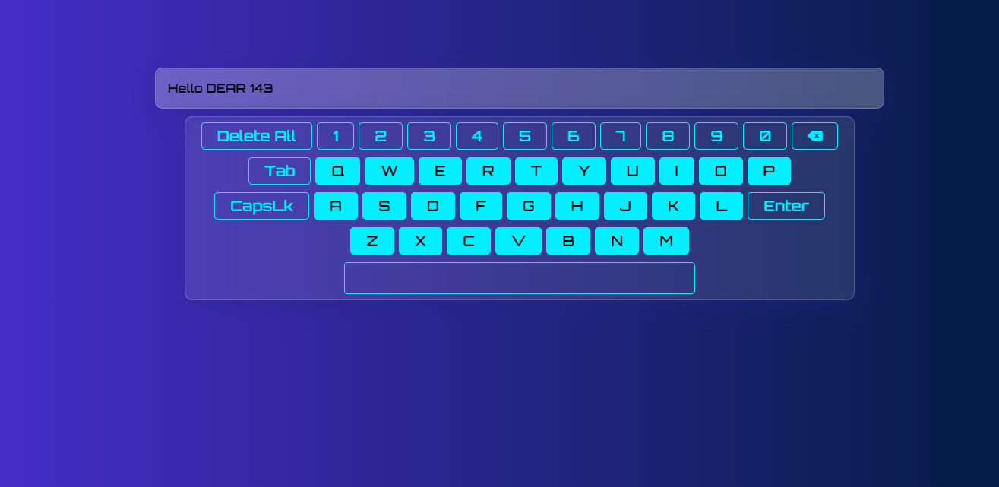

# GRS Orbitron - Virtual Keyboard

A stylish and functional virtual keyboard built with HTML, CSS, and JavaScript. This keyboard uses the Orbitron font and provides an interactive typing experience with sound effects.

<div align="center">
  
</div>
## Features

- **Interactive Keys**: Clickable keys that mimic a real keyboard.
- **Sound Effects**: Each key press produces a mechanical click sound.
- **Special Keys**: Includes functionality for space, enter, backspace, delete all, and caps lock.
- **Custom Fonts**: Uses the Orbitron font for a modern look.
- **FontAwesome Icons**: Utilizes FontAwesome for enhanced visual icons.

## Technologies Used

- HTML
- CSS
- JavaScript
- Google Fonts (Orbitron)

## Setup

### Clone the Repository

```bash
git clone https://github.com/your-username/virtual-keyboard.git
cd virtual-keyboard
```
### Open the Project

Open the `index.html` file in your web browser:

```bash
open index.html
```

## Usage

1. **Type in the Text Box**: Click on the keys to type into the editable text box.
2. **Delete All Text**: Click the "Delete All" button to clear the text box.
3. **Use the Enter Key**: Click the "Enter" key to add a newline.
4. **Use the Space Key**: Click the space bar to add a space.
5. **Backspace**: Click the backspace key to delete the last character.
6. **Toggle Caps Lock**: Click the "CapsLk" key to toggle uppercase letters.

>If you find any issues with project, feel free to submit and issue (Better with the solution)
